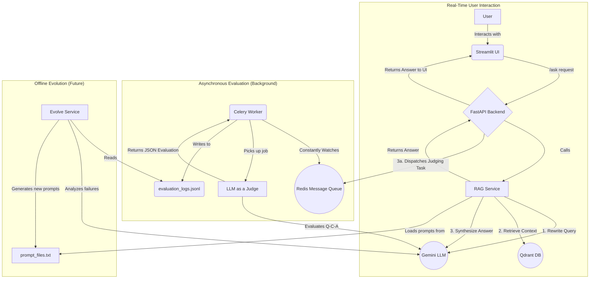

# EvoRAG: The Self-Evolving RAG Pipeline 🧠

[](https://www.python.org/)
[]()

EvoRAG is a next-generation Retrieval-Augmented Generation (RAG) system that learns and improves from user interactions. It features a sophisticated query transformation engine and an asynchronous, LLM-powered evaluation loop, allowing it to evolve its own prompts to become more accurate over time.

---

### 🎥 Live Demo

*(It is **highly recommended** you record a short GIF of the UI in action and place it here. Use a tool like LICEcap, ScreenToGif, or Kap. A visual demo is the most effective way to showcase your project.)*


---

### ✨ Core Features

*   **🧠 Intelligent Query Transformation:** Uses a "Query Rewriter" LLM to convert simple user questions into optimized, keyword-rich queries for superior retrieval accuracy.
*   **🔄 Dual-Prompt System:** Manages separate, external prompts for `Query Rewriting` and `Answer Synthesis`, allowing for targeted improvements.
*   **🤖 Asynchronous LLM-as-a-Judge:** After an answer is served to the user, a background task evaluates the entire interaction chain (query rewrite quality and final answer accuracy) using Celery and Redis.
*   **📈 Automated Feedback Loop:** All evaluations are logged in a structured format, creating a dataset that can be used to automatically identify weaknesses and "evolve" the system's core prompts.
*   **💻 Interactive UI:** A user-friendly, chat-based interface built with Streamlit allows for easy document uploads and conversation.
*   **🚀 Modular & Scalable Architecture:** Built with modern, decoupled services (FastAPI backend, Streamlit frontend, Celery workers) for resilience and scalability.

---

### 🏛️ System Architecture

EvoRAG is composed of several independent services that communicate via a message broker, ensuring a responsive user experience and robust background processing.



---

### 🛠️ Tech Stack

*   **Backend:** FastAPI, Uvicorn
*   **Frontend:** Streamlit
*   **LLMs:** Google Gemini (1.5 Flash for generation, 1.5 Pro for judging)
*   **Vector Database:** Qdrant
*   **Embedding Model:** `google/embeddinggemma-300m`
*   **Document Parsing:** `docling`
*   **Background Tasks:** Celery, Redis
*   **Containerization:** Docker

---

### ⚙️ Setup and Installation

Follow these steps to get the project running locally.

#### Prerequisites
*   Python 3.10+
*   Docker and Docker Compose
*   An active Google AI Studio API Key

#### 1. Clone the Repository
```bash
git clone https://github.com/your-username/EvoRAG.git
cd EvoRAG
```

#### 2. Setup Python Environment and Install Dependencies
```bash
python -m venv .venv
source .venv/bin/activate  # On Windows, use `.venv\Scripts\activate`
pip install -r requirements.txt
```

#### 3. Configure Environment Variables
Create a `.env` file in the project root and add your Gemini API key:
```
GOOGLE_API_KEY="YOUR_API_KEY_HERE"
```

#### 4. Launch Backend Infrastructure with Docker
This will start Qdrant and Redis in the background.
```bash
docker run -d -p 6379:6379 --name redis-evorag redis
docker run -d -p 6333:6333 -p 6334:6334 --name qdrant-evorag \
    -v $(pwd)/qdrant_storage:/qdrant/storage \
    qdrant/qdrant
```

---

### 🚀 Running the Application

The system requires **3 separate terminals** to run the backend services and **1 terminal** for the UI.

**Terminal 1: Start the Celery Worker**
```bash
celery -A tasks worker --loglevel=info
```

**Terminal 2: Start the FastAPI Backend**
```bash
uvicorn api:app --reload```

**Terminal 3: Start the Streamlit Frontend**
```bash
streamlit run ui.py
```

Once all services are running, a browser tab will open with the Streamlit UI.

---

### 📖 How to Use

1.  **Upload a Document:** Use the file uploader in the sidebar to ingest a new document. An animation will play while the document is processed.
2.  **Ask a Question:** Use the chat input at the bottom of the page to ask questions about the document you uploaded.
3.  **View Sources:** Expand the "Show sources and debug info" section under an answer to see which documents were used and how your query was rewritten.
4.  **Start a New Chat:** Click the "New Chat" button in the sidebar to clear the conversation history.

---

### 💡 The "Evolve" Loop Explained

This project is designed for a final, powerful feature: the "Evolve" button. While the button itself is part of the roadmap, the backend logic is already generating the necessary data.

1.  **Judge:** The background Celery worker evaluates every query and answer, producing a detailed JSON log.
2.  **Log:** The `evaluation_logs.jsonl` file collects this feedback, building a rich dataset of the system's strengths and weaknesses.
3.  **Analyze (Future):** An offline script will read the logs and use an LLM to find patterns (e.g., "The system consistently fails at `INCOMPLETE` answers for numerical questions").
4.  **Refine (Future):** The script will feed these findings and the current prompt to an "Optimizer LLM" to generate a new, improved prompt candidate.
5.  **A/B Test (Future):** The new prompt will be benchmarked against the old one on a golden set of questions to prove its superiority before being deployed.

---

### 🗺️ Roadmap & Future Improvements

-   [ ] **"Evolve" Button UI:** Build an admin interface in the Streamlit app to trigger the offline evolution process.
-   [ ] **Human-in-the-Loop Feedback:** Add "👍 / 👎" buttons to the UI to capture direct user feedback and add it to the evaluation logs.
-   [ ] **Advanced Chunking Strategies:** Implement more sophisticated chunking logic based on document type.
-   [ ] **Expanded Database Support:** Add connectors for other vector databases like Weaviate or Pinecone.

This project is licensed under the MIT License. See the `LICENSE` file for details.````
